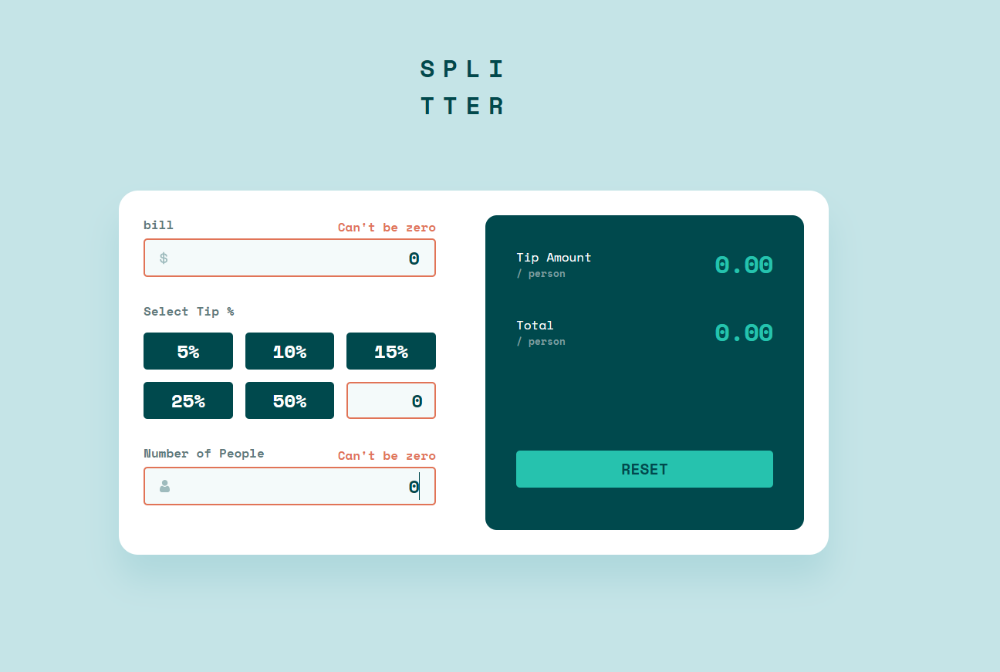
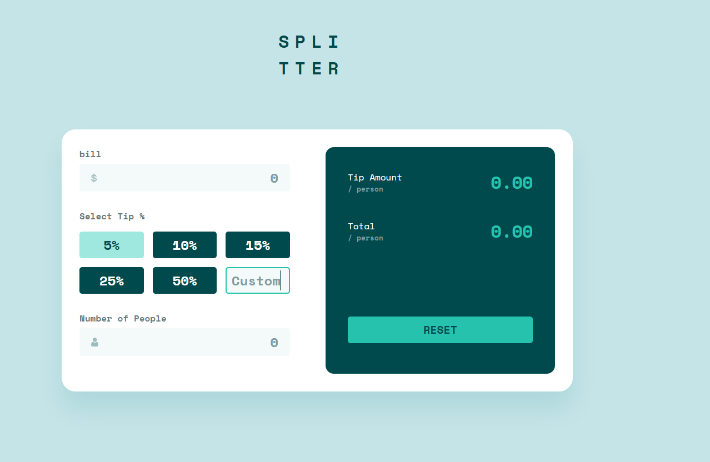
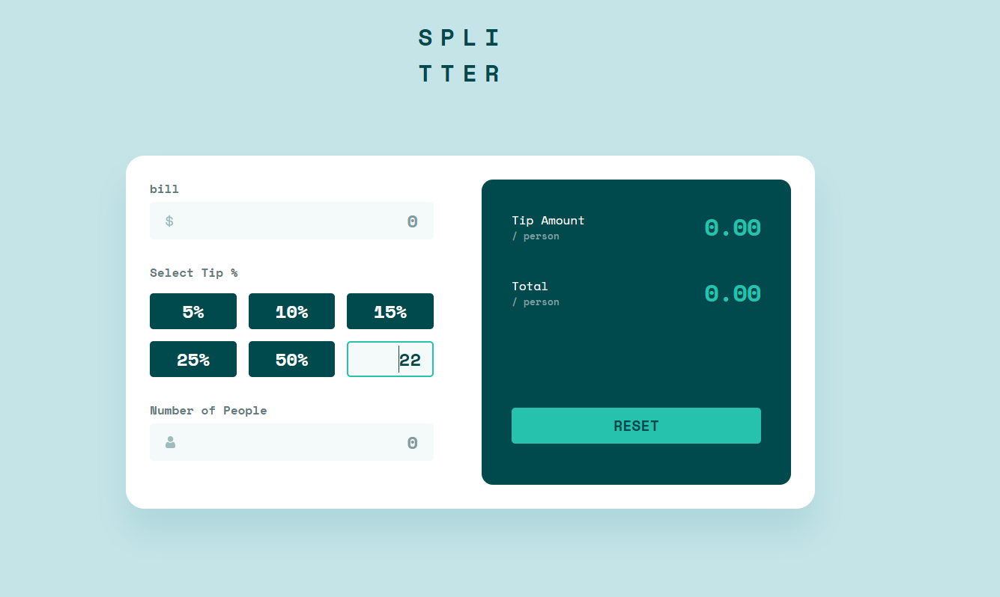
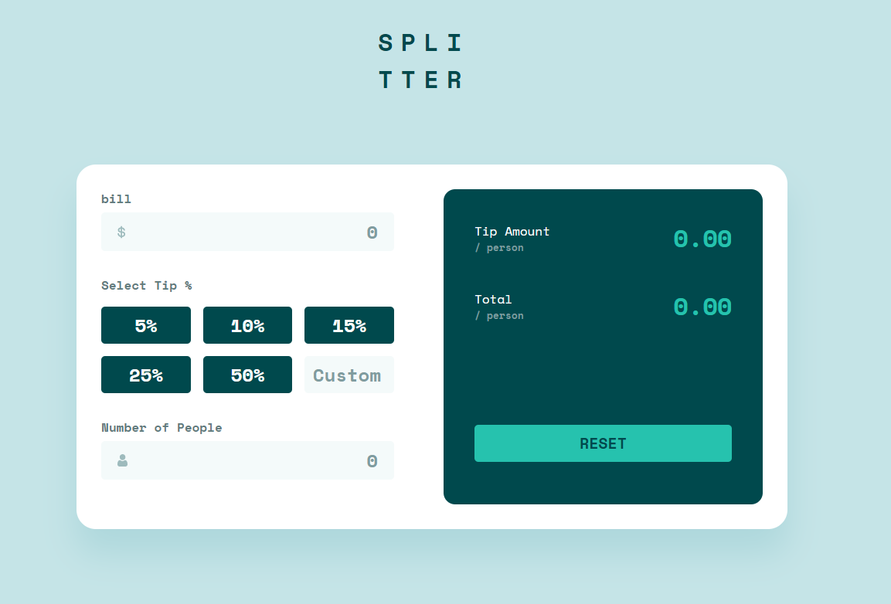

# Frontend Mentor - Tip calculator app solution

This is a solution to the [Tip calculator app challenge on Frontend Mentor](https://www.frontendmentor.io/challenges/tip-calculator-app-ugJNGbJUX). Frontend Mentor challenges help you improve your coding skills by building realistic projects.

## Table of contents

- [Overview](#overview)
  - [The challenge](#the-challenge)
  - [Screenshot](#screenshot)
  - [Links](#links)
- [My process](#my-process)
  - [Built with](#built-with)
  - [What I learned](#what-i-learned)
  - [Continued development](#continued-development)
  - [Useful resources](#useful-resources)
- [Author](#author)
- [Acknowledgments](#acknowledgments)

## Overview

### The challenge

Users should be able to:

- View the optimal layout for the app depending on their device's screen size
- See hover states for all interactive elements on the page
- Calculate the correct tip and total cost of the bill per person

### Screenshots



App programmatically prevents users from inputting 0 as the amount. Border will turn red to indicate error along with text reading "Can't be zero".

Input fields will not allow zero in any form; wether one zero "0" or many "000000". All will produce error message.

Note: decimal number are still permitted such "0.75".





Tip butons have hover and actives states but these states will not remain once user enters input into custom input field. All buttons will lose active states.



Reset button will clear all inputs, text output, and deactive any border states; wheter error(red) or success(green).

### Links

- Live Site URL: [live hosted site of application](https://splitter-app.vercel.app)

## My process

### Built with

- Semantic HTML5 markup
- CSS custom properties
- Flexbox
- CSS Grid
- Mobile-first workflow
- JavsScript

### What I learned

I learned how to debug a particular grid issue surrrounding my custom input field. In addition to that I used optional chaining for the first time in a project and it has really helped me understand how to use it.

### Snippets

Note* I did not know focus-within existed until the project. Can't go back now LOL.

```css
.inputs:focus-within {
  border: 2px solid var(--cyan);
}
```
Note* This was my first time using optional chaining. I have a better understanding of it now.

```js
const checkActive = () => {
  return document
    .querySelector(".percent-btn.active")
    ?.classList.remove("active");
};
```

### Continued development

I realized in this project that I will need t spend more time upgrading my debugging skills LOL. In general I will need to continue to upgrade my JavaScript skills. I want to modularize my files to prevent global Namespaces.

### Useful resources

- [learn javascript online](https://learnjavascript.online/) - I spent some time taking this javascript course and came across a solution for checking for current button active states to remove on the click of a new button. What was most apprecited about this solution was it used the new option chaining which I have never used before but now have a good understanding of because of this problem. It is far less code than having to write out the if and else's.

## Author

  Danny JeanLouis - [linkedIn - personal site in progess](https://www.linkedin.com/in/danny-jeanlouis-3830a9213/)
- Frontend Mentor - [profile on frontend mentors](https://www.frontendmentor.io/profile/djaye33)

## Acknowledgments

I really appreciate Jad Jabroun and his work over at learn Javascript. I also want to thank Grace, Shashi Lo, and Matt from the frontend mentors slack community for helping me solve some problems I encountered along the way.